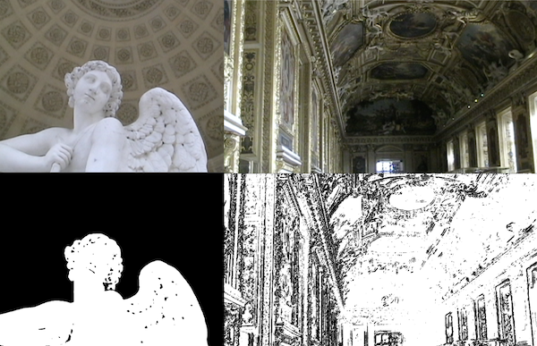

# Low Rent Witchcraft

A scattered assortment of small scripts. Mostly Python.

### Edgy Pixels

Given an image file, apply an **edge detection** filter or a **posterization** filter. 
Generates a new image, doesn't overwrite the original image file.
Uses the Pillow Python library.

**posterize(image file, threshold)**: reduce the brightness levels down to 2 values (black and white)

**detect_edge(image file, threshold)**: create sketchy outlines based on the contrast between pixels
