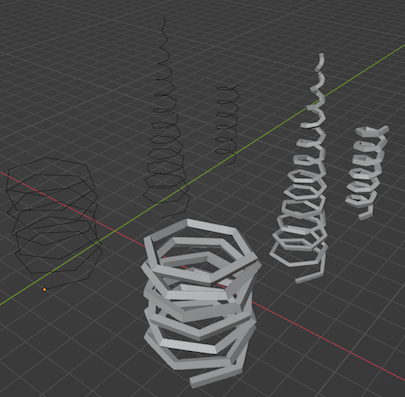

# BLENDER 3D TOOLS

An assortment of convenience tools for Blender 3D.

## just_detach.py

Completely detaches a mesh from an armature without having to clear the parent, clear vertex groups, and then delete the armature modifier manually.

## make_spiral.py

Generates a low-poly spiral of vertices with custom width, length, and tapering.

# MISC

## edgy_pixels.py

Given an image file, apply an **edge detection** filter or a **posterization** filter. 
Generates a new image, doesn't overwrite the original image file.
Uses the Pillow Python library.

**posterize(image file, threshold)**: reduce the brightness levels down to 2 values (black and white)

**detect_edge(image file, threshold)**: create sketchy outlines based on the contrast between pixels

EXAMPLE: `detect_edge(Image.open('mcr_lead_singer.png'), 40)`

